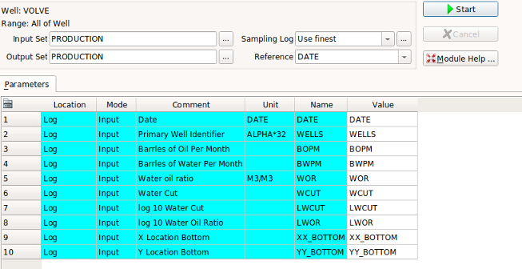
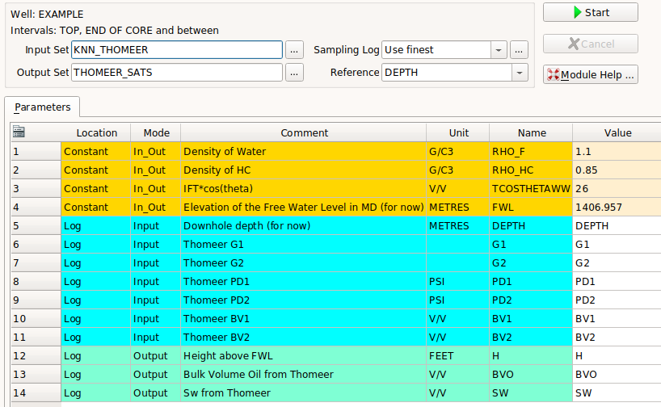
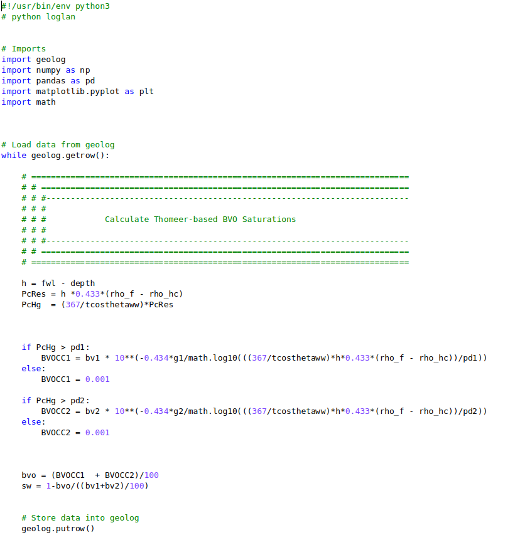

# Geolog Python loglan, layouts, support data and Geolog wells provided in this repository
The objective of this project is to present a variety of Geolog loglans that have been written in python to demonstrate the capabilities of Geolog python loglan where all the well data is being sourced from Geolog wells. 

#### At this time we are supplying four (4) different Geolog projects for the following objectives:
	- Demonstrate the use of Time-series Production data in Geolog from 3 different fields using Altair to display and interrogate the data
	- Demonstrate the use of Altair in Geolog in interrogating Capillary Pressure data from Clerke's Rosetta Stone Carbonate dataset
	- Demonstrate the usefulness of a Geolog loglan written in python for Waxman-Smits log analysis saturations
	- This is a rather holistic Clastic Example that demonstrates the following capabilities in Geolog:
		- Altair's interrogation of well log data
		- Core calibrated NMR data trained to predict permeability using kNN
		- Generate Thomeer parameters and Capillary Pressure curves from core calibrated porosity and permeability using kNN
		- Calculate Thomeer-based Capillary Pressure saturations from our Thomeer parameters
		- Code to generate representative Thin Sections over a well profile using kNN
		- Calculate Waxman-Smits Saturations and generate plots in Geolog. A Jupyter Notebook to serve as the help file 

	- We are in need of an Arab D Carbonate well to demonstrate the entire Thomeer-based Capillary Pressure workflow using Clerke's Rosetta Stone database as our calibration. 

# Examples
## Altair is used to Interrogate Well Log data in this example

The following is a simple example using Altair in a Geolog python loglan. It is not meant to replace any of the great functionality of Geolog, but just serves as an example of programming loglans with python. Using the python loglans found in this repository, from our Geolog well data we are can make fully interactive Altair depth plots, cross plots or histograms. Data from one plot can be selected and then the same appropriate sample data are shown for those selected samples on the other plots. 

#### Geolog Input
This repository also contains Geolog files and subdirectories typically used in any Geolog project. The Geolog files can be loaded into a typical Geolog project format where we have loglan and data subdirectories. From the loglan subdirectory you would load the Geolog_pandas_example_altair.info loglan code and then use Module Launcher to run this program:

The top and bottom interval depths are input as constants and then Geolog loads the designated input log curves into a pandas DataFrame for processing.

## Evaluate Time Series Production Data from field in Geolog using Altair
The objective of this project is to interactively interrogate oil field production data using Altair. We want to interactively interrogate and visualize the well-by-well production data from various wells in the field using python Altair written into a Geolog python loglan. Altair has great potential allowing us to dynamically link our data. 

In the past we have performed this type of work in Spotfire, but now we can do this in Geolog. It is always advantageous to tie our petrophysical results into the actual production and pressures data from a field-wide perspective to understand the productive characteristics of the field. 

## Altair used to Interrogate the Rosetta Stone Capillary Pressure database
The objective of this project is to interrogate Petrophysical core data using python's interactive Altair. This program is available with Geolog python loglan that are included in this repository. 

#### Data:
Clerke's Rosetta Stone Arab-D carbonate data(1) is shown below in the display of our pandas DataFrame. This is Core analysis data. 

Clerke masterfully selected this dataset starting from 1,000's of qualified, inspected core plug samples where the final 450 samples were randomly selected from this total group to create a very unique dataset in that covers the full range in poro-perm space and Petrophysical Rock Types (PRTs) in the Arab D. 

High Pressure Mercury Injection (HPMI) was performed on each of the core plug samples too. The HPMI data was fit to the Thomeer hyperbolas for each pore system present in the sample giving us the Thomeer parameters Pd, G and Bulk Volume Occupied for each pore system.

1) Clerke, E. A., Mueller III, H. W., Phillips, E. C., Eyvazzadeh, R. Y., Jones, D. H., Ramamoorthy, R., Srivastava, A., (2008) “Application of Thomeer Hyperbolas to decode the pore systems, facies and reservoir properties of the Upper Jurassic Arab D Limestone, Ghawar field, Saudi Arabia: A Rosetta Stone approach”, GeoArabia, Vol. 13, No. 4, p. 113-160, October, 2008. 

## kNN used to Predict Thomeer Capillary Pressure parameters and generate Capillary Pressure Curves based on a Thomeer core database
We use kNN to estimate Thomeer parameters and Capillary Pressure curves from Porosity and Permeability inputs and query our clastic Thomeer database for our estimations.

The following is a single example of how we select a point in poro-perm space and then estimate the Thomeer parameters and Pc curves based on these inputs. In our Geolog program we actually perform these estimations for Thomeer parameters and Pc curves over the entire reservoir interval.

## Capillary Pressure Curves are Calculated from the Thomeer parameters and Capillary Pressure based saturations are calculated above the estimated Free Water Level (FWL) elevation. 
In this module we calculate Capillary Pressure Curves from the above derived Thomeer parameters and then calculate Capillary Pressure based saturations above the FWL.

The following is the simple code that was used to make this initial saturation calculations. In the final version of this code we will use the upscaled Pc curve data to calculate our saturations. This is work in progress. 

## Petrophysical Reservoir Characterization workflow for a Complex Arab D Carbonate using the Rosetta Stone database as our calibration dataset for Petrophysical Rock Types and Thomeer Capillary Pressure parameters

	- We are in need of an Arab D Carbonate well to demonstrate the entire Thomeer-based Capillary Pressure workflow using Clerke's Rosetta Stone database as our calibration. 

	- This Carbonate Example will capture the petrophysical workflow of characterizing an Arab D Carbonate in Geolog:
		- Estimate Permeability based on core calibration using either Facimage or kNN provided in this repository
		- Generate Thomeer parameters and Capillary Pressure curves from our core calibrated porosity and permeability using the Arab D Rosetta Stone calibration data using our kNN Map Inversion
		- Calculate our initial Thomeer-based Capillary Pressure saturations from our Thomeer parameters
			- What FWL should we use initially?
			- What IFT*cos(theta) is being used in this carbonate reservoir? It is a near guarantee that it is not 26 as seen in many clastic examples
			- Does the hydrocarbon density or IFT*cos(theta) vary with depth?
			- Does the FWL vary across the field due to structural tilting or a dynamic aquifer? We need to understand the dynamic aspects of our reservoir.
			- Does a Paleo FWL exist in this reservoir allowing for residual oil saturations below the FWL? 
		- Perform a FWL search on the perimeter wells to estimate the original FWL and possible Paleo FWL from any older wells free from productive influence and water encroachment
		- Calculate final Thomeer-based Capillary Pressure saturations from our Thomeer parameters using the refined FWL and possible Paleo FWL if needed
		- Calculate Thomeer-based Capillary Pressure saturations for all wells with good data over the entire field
		- Review all wells to understand the differences between the log analysis based Bulk Volume Oil and the Bulk Volume Oil from this process
			- Are the oil volumes consistent above intervals of water encroachment?
			- Are the areas demonstrating water encroachment consistent with movement of current fluid contacts and production?
			- Can we map the intervals of water encroachment to be used in our Reservoir Simulation? 
		
