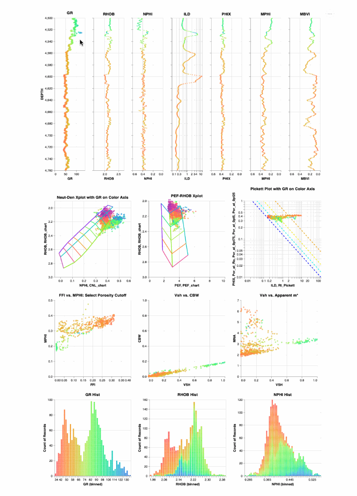
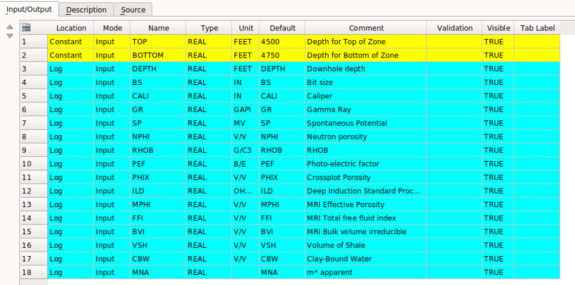
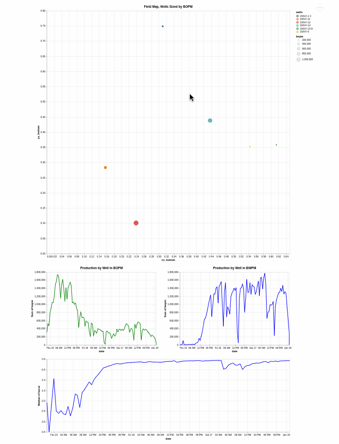
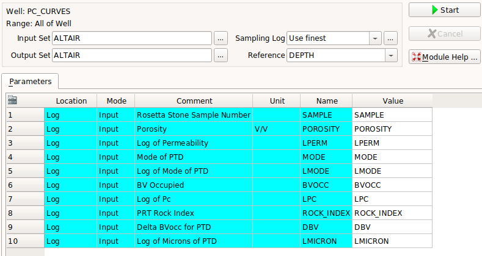
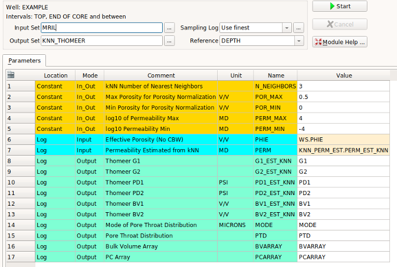
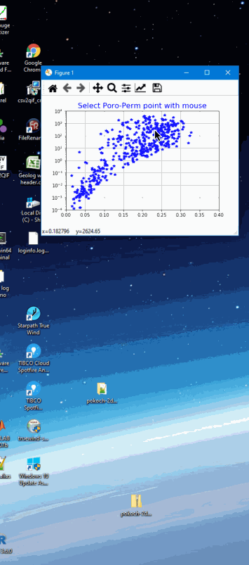

# Geolog Python loglan, layouts, data and wells examples
The objective of this project is to present a variety of Geolog loglans that have been written in python to demonstrate the capabilities of Geolog python loglan where all well data is being sourced from Geolog wells. 

#### At this time there are four (4) different projects
	- Demonstrate the use of Time-series Production data from 3 fields using Altair
	- Demonstrate the use of Altair in interrogating the Capillary Pressure data from Clerke's Rosetta Stone Carbonate Dataset
	- Demonstrate the usefulness of a Geolog loglan written in python for Waxman-Smits analysis 
	- A rather holistic Clastic Example that demonstrates the following:
		- Altair interrogation of log data
		- Core calibrated NMR data trained to predict permeability using kNN
		- Generate Thomeer parameters and Capillary Pressure curves from core calibrated porosity and permeability using kNN
		- Thomeer-based Capillary Pressure saturations
		- Using kNN generate representative Thin Sections over a well profile
		- Waxman-Smits Saturations with plots out of Geolog and a Jupyter Notebook to serve as the help file 

## Altair used to Interrogate Well Log data

The following is a simple example of using Altair in a Geolog python loglan. It is not meant to replace any of the great functionality of Geolog, but just serves as an example of programming loglans with python. Using the python loglans found in this repository, from our Geolog well data we are can make depth plots, cross plots or histograms using Altair. Data from one plot can be selected and then the same appropriate sample data are shown for those selected samples in the other plots. 

This is just a simple example where we are only using Altair in Geolog to interrogate the well log data to better understand these data. 

#### Geolog Input
This repository also contains Geolog files and subdirectories typically used in any Geolog project. The Geolog files can be loaded into a typical Geolog project format where we have loglan and data subdirectories. From the loglan subdirectory you would load the Geolog_pandas_example_altair.info loglan code and then use Module Launcher to run this program:

The top and bottom interval depths are input as constants and then Geolog loads the designated input log curves into a pandas DataFrame for processing.

## Time Series Production Data from field
The objective of this project is to interactively interrogate oil field production data using Altair. We want to interactively interrogate and visualize the well-by-well production data from various Fields using python Altair written into a Geolog python loglan. Altair has great potential allowing us to dynamically link our data. 

We normally do this type of work in Spotfire where we always prefer to tie our petrophysical results into the actual production and pressures from a field-wide perspective. 

## Altair used to Interrogate Capillary Pressure data
The objective of this project is to interrogate Petrophysical core data using python's interactive Altair. This program is also available with Geolog python loglan that are included in this repository. 

#### Data:
Clerke's Rosetta Stone Arab-D carbonate data(1) is shown below in the display of our pandas DataFrame. This is Core analysis data. 

Clerke masterfully selected this dataset starting from 1,000's of qualified, inspected core plug samples where the final 450 samples were randomly selected from this total group to create a very unique dataset in that covers the full range in poro-perm space and Petrophysical Rock Types (PRTs) in the Arab D. 

High Pressure Mercury Injection (HPMI) was performed on each of the core plug samples too. The HPMI data was fit to the Thomeer hyperbolas for each pore system present in the sample giving us the Thomeer parameters Pd, G and Bulk Volume Occupied for each pore system.

1) Clerke, E. A., Mueller III, H. W., Phillips, E. C., Eyvazzadeh, R. Y., Jones, D. H., Ramamoorthy, R., Srivastava, A., (2008) “Application of Thomeer Hyperbolas to decode the pore systems, facies and reservoir properties of the Upper Jurassic Arab D Limestone, Ghawar field, Saudi Arabia: A Rosetta Stone approach”, GeoArabia, Vol. 13, No. 4, p. 113-160, October, 2008. 

## kNN used to Predict Thomeer Capillary Pressure parameters and generate Capillary Pressure Curves
We use kNN to estimate Thomeer parameters and Capillary Pressure curves from Porosity and Permeability inputs and query our clastic Thomeer database for our estimations.

The following is an example of how we select a point in poro-perm space and estimate the Thomeer parameters and Pc curves based on these inputs.

